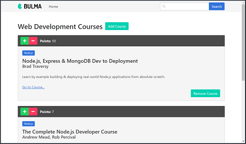

# Angular App with GraphQL Server
This project demonstrates the implementation of a GraphQL server using the Apollo server and Apollo engine in the backend and a GraphQL client on the frontend using Angular and Apollo client.  This project has been modified from the original project created from the Udemy course [GraphQL with Angular & Apollo - The Full-stack Guide](https://www.udemy.com/graphql-angular-apollo-full-stack/) by *Sebastian Eschweiler*.  The project has been updated to use Typescript and the Apollo Engine on the backend as well as the Bulma CSS framework for the frontend.

<p align="center">
    <br>
</p>

## Versions
* MongoDB v3.6 (Mongoose v5.0.12)
* Express v4.16.3
* Angular v5.2.9 (Angular CLI v1.7.3)
* [Bulma CSS Framework v0.62](https://bulma.io/)
* Node.js v9.10.1

## GraphQL Server
* Graphql v0.13.2
* Graphql-tools v2.23.1
* Apollo-server-express v1.3.4
* Apollo-engine v2.2.8

## GraphQL Client
* Graphql v0.13.2
* Graphql-tag v2.8.0
* Apollo-client v2.2.8
* Apollo-angular v1.0.1
* Apollo-angular-link-http v1.0.2
* Apollo-cache-inmemory v1.1.12

## Cloning the Project for Personal Use
### Installation
1. Clone this repo `git clone https://github.com/stanleyeosakul/angular-graphql.git`
1. `cd` into the folder of the cloned repo
1. Run `yarn install` to install dependencies
1. Configure your keys file `node_src/config/keys.ts`
    * From the root directory, create the keys file `touch node_src/config/keys.ts`
    * Enter your `Apollo API key` from the <a href="https://engine.apollographql.com" target="_blank">Apollo Engine API</a> into `keys.ts`

        ```typescript
          export const keys = {
            mongoURI: 'mongodb://localhost:27017/angular-graphql',
            ApolloAPIKey: '<your-apollo-engine-key-goes here>'
          };
        ```

1. Run `yarn run start-ts`, and navigate to `http://localhost:3000/`